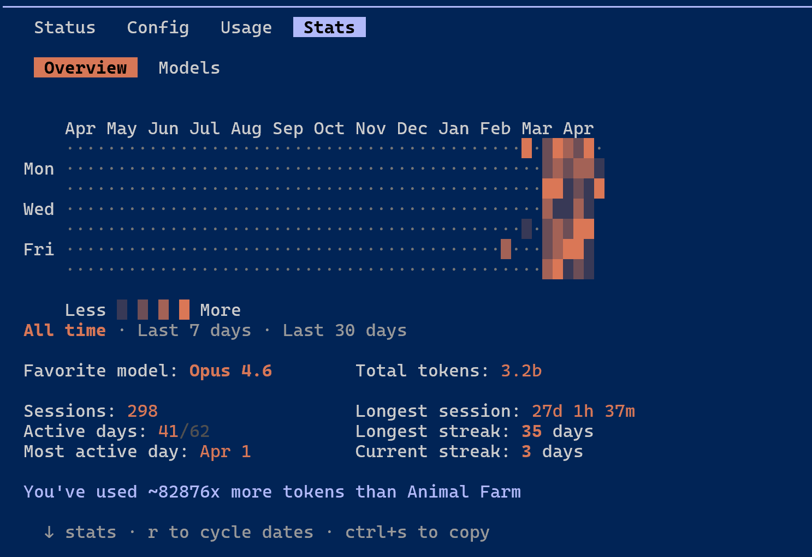
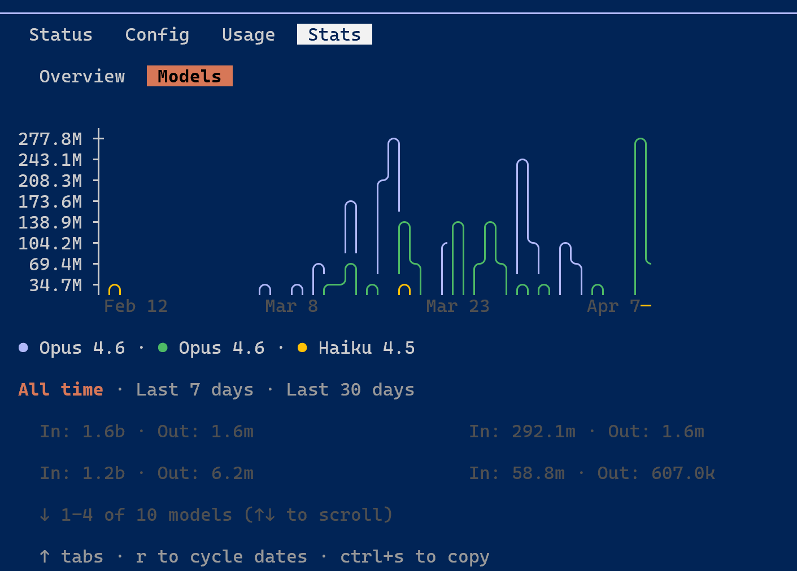

# Multi-Subject Auth System

多主体认证系统，支持 Member / Staff / Admin 三种角色的注册、登录、TOTP 双因素认证、Passkey (WebAuthn) 和会话管理。

## 技术栈

| 层 | 技术 |
|---|------|
| 后端 | Rust + Axum + SQLx |
| 前端 | React 19 + TypeScript + Vite + Ant Design |
| 数据库 | PostgreSQL 16 |
| 缓存 | Redis 7 (会话 + MFA token) |
| 认证 | JWT + TOTP + WebAuthn |

## 架构

```
backend/src/
  domain/         # 领域模型、仓储接口、错误定义
  application/    # DTO、Service 层（业务逻辑）
  infrastructure/ # 仓储实现(PostgreSQL)、密码哈希、JWT
  presentation/   # Handler、Router、中间件(Claims 提取)
```

采用分层架构，handler → service → repository，依赖方向单向向内。

## 快速启动

```bash
# 1. 启动基础设施
docker compose up -d

# 2. 配置环境变量
cp backend/.env.example backend/.env

# 3. 启动后端 (自动执行数据库迁移)
cd backend && cargo run

# 4. 启动前端
cd frontend && npm install && npm run dev
```

访问 http://localhost:5173

## API 端点

| 方法 | 路径 | 认证 | 说明 |
|------|------|------|------|
| GET | /api/health | - | 健康检查 |
| POST | /api/subjects/register | - | 注册 |
| POST | /api/auth/{type}/login | - | 登录 (type: member/staff/admin) |
| POST | /api/auth/mfa/verify | - | MFA 验证 |
| GET | /api/subjects/me | Bearer | 当前用户信息 |
| POST | /api/auth/logout | Bearer | 登出 |
| GET | /api/credentials/status | Bearer | 凭证状态 |
| POST | /api/credentials/totp/setup | Bearer | 设置 TOTP |
| POST | /api/credentials/totp/verify | Bearer | 验证 TOTP |
| GET | /api/sessions | Bearer | 会话列表 |
| DELETE | /api/sessions/{id} | Bearer | 撤销会话 |

## 设计决策

- **多主体分离**: 同一用户名可在不同角色下注册，通过 `subject_type` 区分
- **JWT + Redis 双层会话**: JWT 无状态验证 + Redis 支持即时撤销
- **TOTP 双因素**: 登录时检测是否启用 TOTP，启用则返回 `mfa_token` 要求二次验证
- **密码安全**: Argon2 哈希，token 存储使用 SHA-256 哈希

## Token 账单（近半年）




